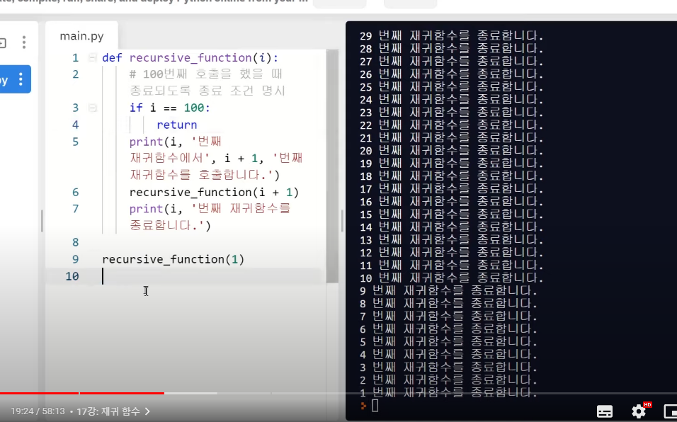
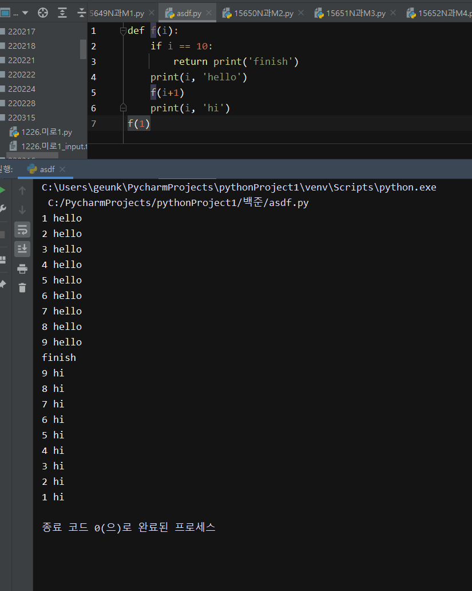
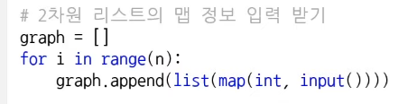
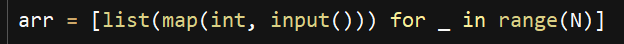

# '22.03.21. 월요일

**수업** : 컴퓨팅 사고력 --> 과제 2문제

* 명제 --> 진리표 작성
* 귀류법
* 조합론 --> 경우의수  --> 완전탐색
* 등차수열의 합 / 등비수열의 합
* 피보나치 수열 --> 재귀
* 시간복잡도

**보충(18:30 ~ 20:00)**

 

**알고리즘 스터디 (22:00 ~ 23:30)**

* 문제 : 안전영역 ---> 접근 못함

# '22.03.22. 화요일

**수업** : 컴퓨팅 사고력 --> 과제 2문제

* 재귀를 통한 시간복잡도 문제 풀이

**백준 문제 풀이**

* 11725 트리의 부모찾기 --> 실패

알고리즘 스터디

* 안전영역 다시 풀이

# '22.03.23. 수요일

**수업** --> 과제 1문제 :  SWEA 단순 2진 암호코드

* SW문제해결
* 복잡도 분석
  * 빅오 : 점근적 상한
  * 빅오메가 : 점근적 하한
  * 빅세타 : 빅오 = 빅오메가
* 표준 입출력 방법
* 비트연산
* 진수
* 실수

# '22.03.24. 목요일

**수업** --> 이진수, 암호코드 스캔

**백준 문제 풀이**

* 1260DFS와BFS
* 동빈나 유투브 강의 --> 이해가 안감

# '22.03.25. 금요일

**수업** --> 4366.정식이의 은행업무, 2382.미생물 격리, 4615.오셀로

# '22.03.27. 일요일

둘 다 상관없나??

동빈나_미로 --> bfs를 dfs로 풀어도 되나?

# '22.03.28. 월요일

월말평가 --> break사용실수

수업--> 순열, 조합, 부분집합

# '22.03.29. 화요일

수업 --> SWEA 문제(최소합, 전자카트, 컨테이너 운반, 화물 토크, 베이비진 게임)

# '22.03.30. 수요일

수업 --> 백트래킹

# '22.03.31. 목요일

수업--> SWEA문제풀이

# '22.04.01. 금요일

수업--> DFS, BFS 복습
