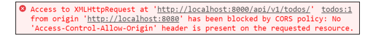

#### 1. 아래의 설명을 읽고 T/F 여부를 작성하시오.

```
- Client-Server 모델에서 Vue는 Client 파트, DRF는 Server 파트를 담당한다. T
- DRF로 설계한 서버는 Vue 클라이언트에만 사용가능하다. F
- API 서버의 인증방식은 기존 django 서버의 인증방식과 동일해야만 한다. F
```


#### 2. 아래 예시는 Vue에서 Django 서버로 네트워크 요청을 보냈을 때 발생한 에러다. 에러가 발생한 원인과 해결 방법을 작성하시오.



```
Same-Origin Policy --> 동일 출처 정책(SOP)
스키마/프로토콜(Scheme/Protocol), 호스트(Host), 파트(Port)가 같아야 된다.
```

