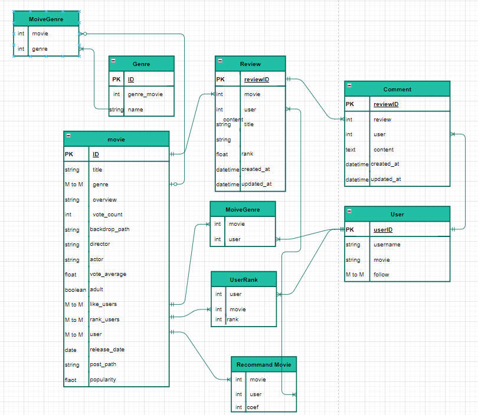

#  영화추천 알고리즘

## 목차

### 1, 소개(프로젝트 이름, 팀원소개, 업무분담, 전체일정, 세부일정)

### 2, 핵심기능 (요구사항)

### 3, 설계내용(모델링, URL설계)

# 1, 소개(프로젝트 이름, 팀원소개, 업무분담)

## 프로젝트 이름 : SuperMovie(슈퍼무비)

### 팀원 소개, 업무 분담

#### Kin Geun Ho & Lee Dong Myeong

* 김근호 : Front-end - 화면 설계 및 디자인, Vue Cli 및 Axios를 통한 REST API 활용
* 이동명 : Back-end - DB/ Django REST API 설계, Vue Cli 및 Axios 로직 구현
* 업무 분담을 했지만, 서로의 코드를 보충해주는 형태로 프로젝트 진행

**사용할 아키텍처**

* Vue.js

- Django REST API

### 전체 일정

| 인원\요일 | 금              | 토      | 일   | 월                               | 화                   | 수         | 목         |
| --------- | --------------- | ------- | ---- | -------------------------------- | -------------------- | ---------- | ---------- |
| 김근호    | 기획/모델링완성 | URL설계 | 휴식 | vue component구현                | 화면 설계 및 디자인  | 부트스트랩 | 최종마무리 |
| 이동명    | 기획/모델링완성 | URL설계 | 휴식 | django db설계 및 Axois 로직 구현 | django rest api 설계 | 부트스트랩 | 최종마무리 |

# 2, 핵심기능

### 요구사항

**아래의 세부 요구사항은 필수 기능으로 프로젝트 내에 반드시 포함되어야 합니다. 이 외의 추가적인 기능 및 디자인 등은 팀 별로 자유롭게 수행할 수 있습니다.** 

##### A. 관리자 뷰 

i. 관리자 권한의 유저만 영화 등록 / 수정 / 삭제 권한을 가집니다. 

ii. 관리자 권한의 유저만 유저 관리 권한을 가집니다.

iii. Django에서 기본적으로 제공하는 admin 기능을 이용하여 구현합니다. 

iv. Vue.js를 활용하는 경우에도 Django admin 기능을 이용하여 구현할 수 있습니다. 

##### B. 영화 정보 

i. 영화 데이터는 Database Seeding을 활용하여 최소 50개 이상의 데이터가 존재하도록 구성해야 합니다. 

ii. 로그인 된 유저는 영화에 대한 평점 등록 / 수정 / 삭제 등을 할 수 있어야 합니다. 

##### C. 영화 추천 알고리즘 

i. 영화를 평가한 유저는 해당 정보를 기반으로 영화를 추천 받을 수 있어야 합니다.

ii. 추천 알고리즘의 지정된 형식은 없으나, 사용자는 반드시 최소 1개 이상의 방식으로 영화를 추천 받을 수 있어야 합니다. 

iii. 추천 방식은 각 팀별로 자유롭게 선택할 수 있으며, 어떠한 방식으로 추천 시스템을 구현 했는지 기술적으로 설명할 수 있어야 합니다. 

##### D. 커뮤니티 

i. 영화 정보와 관련된 소통을 할 수 있는 커뮤니티 기능을 구현해야 합니다. 

ii. 로그인 사용자만 글을 조회 / 생성 할 수 있으며, 작성자 본인만 글을 수정 / 삭제 할 수 있습니다. 

iii. 사용자는 작성된 게시 글에 댓글을 작성할 수 있어야 하며 작성자 본인만 댓글을 삭제할 수 있습니다. 

iv. 각 게시글 및 댓글은 생성 및 수정 시각 정보가 포함되어야 합니다.

E. 기타 

i. 최소한 5개 이상의 URL 및 페이지를 구성해야 합니다. 

ii. HTTP Method와 HTTP response status codes는 상황에 맞게 적절하게 반환되어야 하며, 필요에 따라 메시지 프레임워크 등을 사용하여 에러 페이지를 구성해야 합니다.

# 3, 모델링

