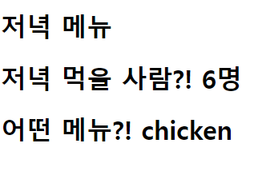

# 1. intro/urls.py

```python
"""intro URL Configuration


The `urlpatterns` list routes URLs to views. For more information please see:

  https://docs.djangoproject.com/en/3.2/topics/http/urls/

Examples:

Function views

  \1. Add an import:  from my_app import views

  \2. Add a URL to urlpatterns:  path('', views.home, name='home')

Class-based views

  \1. Add an import:  from other_app.views import Home

  \2. Add a URL to urlpatterns:  path('', Home.as_view(), name='home')

Including another URLconf

  \1. Import the include() function: from django.urls import include, path

  \2. Add a URL to urlpatterns:  path('blog/', include('blog.urls'))

"""

from django.contrib import admin

from django.urls import path

from django import views

from pages import views


urlpatterns = [

  path('admin/', admin.site.urls),

  path('dinner/<str:menu>/<int:nop>', views.dinner),

]
```


# 2. pages/views.py

```python


from multiprocessing import context

from django.shortcuts import render


\# Create your views here.


def dinner(request, menu, nop):

  context = {

​    'menu' : menu,

​    'nop' : nop,

  }

  return render(request, 'dinner.html', context)
```


# 3. templates/dinner.html

<!DOCTYPE html>

<html lang="en">

<head>

    <meta charset="UTF-8">
    
    <meta http-equiv="X-UA-Compatible" content="IE=edge">
    
    <meta name="viewport" content="width=device-width, initial-scale=1.0">

  <title>Document</title>

</head>

<body>

  <h1>저녁 메뉴</h1>

  <h1>저녁 먹을 사람?! {{ nop }}명</h1>

  <h1>어떤 메뉴?! {{ menu }}</h1>

</body>

</html>