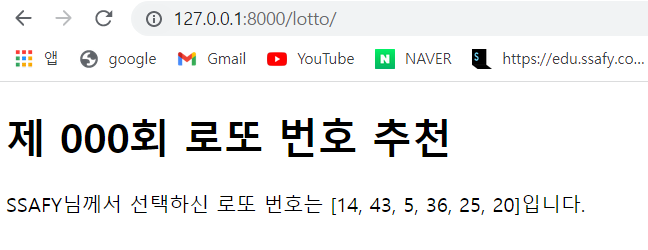

```python
"""intro URL Configuration

The `urlpatterns` list routes URLs to views. For more information please see:
    https://docs.djangoproject.com/en/3.2/topics/http/urls/
Examples:
Function views
    1. Add an import:  from my_app import views
    2. Add a URL to urlpatterns:  path('', views.home, name='home')
Class-based views
    1. Add an import:  from other_app.views import Home
    2. Add a URL to urlpatterns:  path('', Home.as_view(), name='home')
Including another URLconf
    1. Import the include() function: from django.urls import include, path
    2. Add a URL to urlpatterns:  path('blog/', include('blog.urls'))
"""
from django.contrib import admin
from django.urls import path
from pages import views

urlpatterns = [
    path('admin/', admin.site.urls),
    path('lotto/', views.lotto)
]

```

```python
import random
from django.shortcuts import render

# Create your views here.


def lotto(request):
    name = 'SSAFY'
    lotto_n = []
    for i in random.sample(range(1, 46), 6):
        lotto_n.append(i)

    context = {
        'name': name,
        'lotto_n': lotto_n
    }
    return render(request, 'lotto.html', context)
```

```python
<!DOCTYPE html>
<html lang="en">
<head>
    <meta charset="UTF-8">
    <meta http-equiv="X-UA-Compatible" content="IE=edge">
    <meta name="viewport" content="width=device-width, initial-scale=1.0">
    <title>Document</title>
</head>
<body>
    <h1>제 000회 로또 번호 추천</h1>
    <p>{{ name }}님께서 선택하신 로또 번호는 {{ lotto_n }}입니다.</p>
</body>
</html>
```

