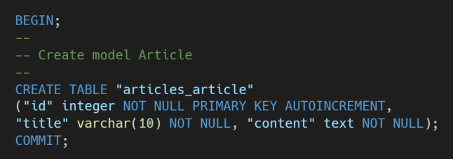
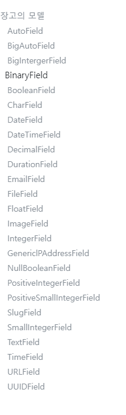

## 1.Model 반영하기

migrations

## 2. Model 변경사항 저장하기

1. python manage.py migrate
2. python manage.py sqlmigrate articles 0001

## 3. Python shell

python manage.py shell_plus

## 4. Django Model Field

