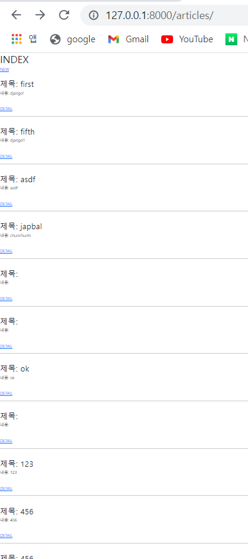
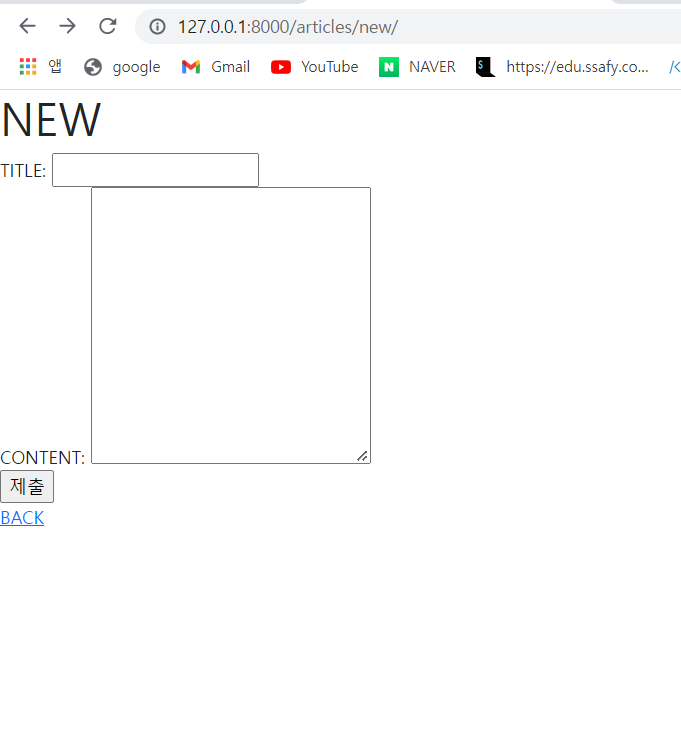
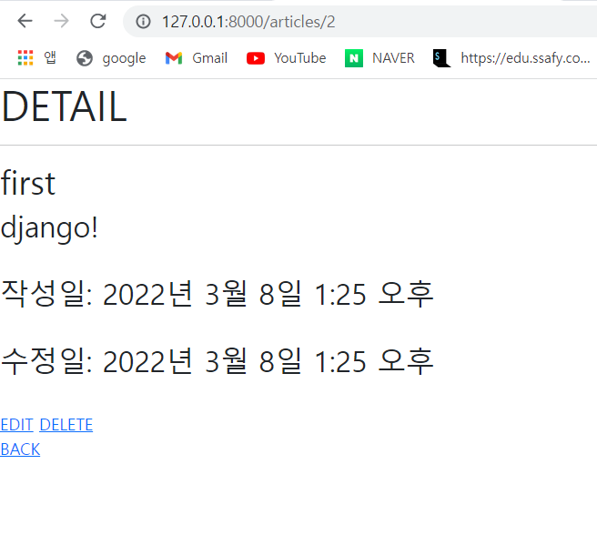

# 1. url

```python
from django.urls import path
from . import views

app_name = 'articles'
urlpatterns = [
    path('', views.index, name='index'),
    path('new/', views.new, name='new'),
    path('create/', views.create, name='create'),
    path('<int:pk>', views.detail, name='detail'),
    path('<int:pk>/delete/', views.delete, name='delete'),
    path('<int:pk>/edit/', views.edit, name='edit'),
    path('<int:pk>/update/', views.update, name='update'),
]
```

# 2. view

```python
from django.shortcuts import redirect, render
from .models import Article

# Create your views here.
def index(request):
    articles = Article.objects.all()
    context = {
        'articles' : articles,
    }
    return render(request, 'articles/index.html', context)

def new(request):
    return render(request, 'articles/new.html')

def create(request):
    title = request.POST.get('title')
    content = request.POST.get('content')
    article = Article(title=title, content=content)
    article.save()
    return redirect('articles:detail', article.pk)

def detail(request, pk):
    article = Article.objects.get(pk=pk)
    context = {
        'article' : article,
    }
    return render(request, 'articles/detail.html', context)

def delete(request, pk):
    article = Article.objects.get(pk=pk)
    article.delete()
    return redirect('articles:index')

def edit(request, pk):
    article = Article.objects.get(pk=pk)
    context = {
        'article' : article
    }
    return render(request, 'articles/edit.html', context)

def update(request, pk):
    article = Article.objects.get(pk=pk)
    article.title = request.POST.get('title')
    article.content = request.POST.get('content')
    article.save()
    return redirect('articles:detail', article.pk)
```

# 3. template

```python


<h1>NEW</h1>
<form action="" method="POST">
    
    <label for="title">TITLE:</label>
    <input type="text" name="title" id="title"><br>
    <label for="content">CONTENT:</label>
    <textarea name="content" id="content" cols="30" rows="10"></textarea><br>
    <input type="submit">
</form>
<a href="">BACK</a>

```

```python


<h1>INDEX</h1>
<a href="">NEW</a><br>

    <br>
    <h2>제목: {{ article.title }}</h2>
    <p>내용: {{ article.content }}</p>
    <br>
    <a href="">DETAIL</a>
    <hr>
    

```

```python


<h1>EDIT</h1>

<form action="" method="POST">
    
    <label for="title">TITLE:</label>
    <input type="text" name="title" id="title" value="{{ article.title }}"><br>
    <label for="content">CONTENT</label>
    <textarea name="content" id="content" cols="30" rows="10">{{ article.content }}</textarea><br>
    <input type="submit">
</form>
<a href="">BACK</a>


```

```python


<h1>DETAIL</h1>
<hr>
<h2>{{ article.title }}</h2>
<h3>{{ article.content }}</h3><br>
<h3>작성일: {{ article.created_at }}</h3><br>
<h3>수정일: {{ article.updated_at }}</h3><br>
<a href="">EDIT</a>
<a href="">DELETE</a><br>
<a href="">BACK</a>

```

# 4. model

```python
from msilib.schema import Class
from django.db import models

# Create your models here.
class Article(models.Model):
    title = models.CharField(max_length=10)
    content = models.TextField()
    created_at = models.DateTimeField(auto_now_add=True)
    updated_at = models.DateTimeField(auto_now=True)

```

