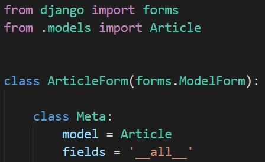

### 1. 각 문항을 읽고 맞으면 T, 틀리면 F를 작성하시오. 

1. ModelForm을 사용할 때 Meta 클래스 내부에 model과 fields 변수는 반드시 작성해야 한다. (F)

   fields 또는 exclude

2. ModelForm을 사용할 때는 렌더링 되는 input element 속성은 Django에서 제공 해주는 대로만 사용해야 한다. (F)

3. 화면에 나타나는 각 element 위치는 html에서 form.as_p()를 사용하지 않아도 직접 위치시킬 수 있다. (T)

### 2. 다음 빈칸 (a) ~ (d) 에 적합한 코드를 작성하시오.

a = forms

b = forms.ModelForm

c  = Article

d = fields