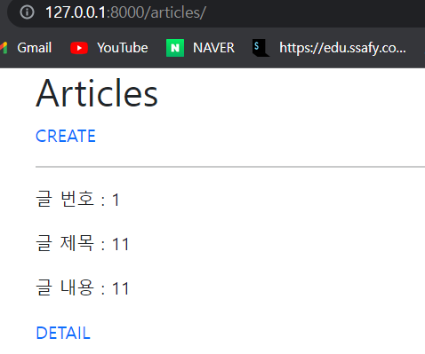
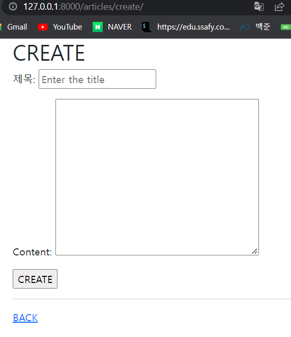
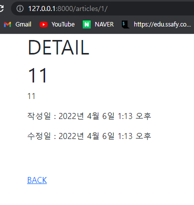

# url

```python
from django.urls import path
from . import views


app_name = 'articles'
urlpatterns = [
    path('', views.index, name='index'),
    # path('new/', views.new, name='new'),
    path('create/', views.create, name='create'), # GET/POST
    path('<int:pk>/', views.detail, name='detail'),
    # path('<int:pk>/delete/', views.delete, name='delete'),
    # path('<int:pk>/edit/', views.edit, name='edit'),
    # path('<int:pk>/update/', views.update, name='update'),
]

```

# view

```python
from django.shortcuts import render, redirect
from .models import Article
from .forms import ArticleForm

# Create your views here.
def index(request):
    articles = Article.objects.all()
    context = {
        'articles': articles,
    }
    return render(request, 'articles/index.html', context)


def create(request):
    if request.method == 'POST':
        #creat
        form = ArticleForm(request.POST)
        if form.is_valid(): #유효성 검사
            article = form.save()
            return redirect('articles:detail', article.pk)
        # print(form.errors)
        # return redirect('articles:new')
    else:
        #new
        form = ArticleForm()
    context = {
        'form': form,
    }
    return render(request, 'articles/create.html', context)


def detail(request, pk):
    article = Article.objects.get(pk=pk)
    context = {
        'article': article,
    }
    return render(request, 'articles/detail.html', context)


```

# template

```




  <h1>CREATE</h1>

  <form action="" method="POST">
    
    {{ form.as_p }}
     <label for="title">Title: </label>
    <input type="text" id="title" name="title"><br>
    <label for="content">Content: </label>
    <textarea name="content" id="content" cols="30" rows="10"></textarea> 
    <input type="submit" value="CREATE">
    <hr>
  </form>
  <a href="">BACK</a>
  


```

```



  <h1>DETAIL</h1>
  <h1>{{ article.title }}</h1>

  <p>{{ article.content }}</p>
  <p>작성일 : {{ article.create_at }}</p>
  <p>수정일 : {{ article.update_at }}</p>
  <br>
  <br>
  </form>
  <a href="">BACK</a>

```

```



<div class='mx-3'>
  <h1>Articles</h1>
  <a href="" class="text-decoration-none">CREATE</a>
  <br>
  <hr>
  
    <p> 글 번호 : {{ article.id }}</p> 
    <p> 글 제목 : {{ article.title }}</p>
    <p> 글 내용 : {{ article.content }}</p>
    <a href="" class="text-decoration-none">DETAIL</a>
    <hr>
  
</div>


```

# model

```
from django.db import models

# Create your models here.
class Article(models.Model):
    title = models.CharField(max_length=10)
    content = models.TextField()
    created_at = models.DateTimeField(auto_now_add=True)
    updated_at = models.DateTimeField(auto_now=True)

    def __str__(self):
        return self.title

```

