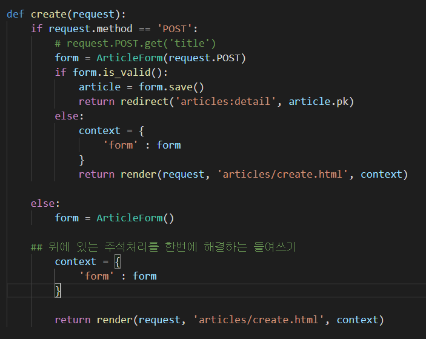
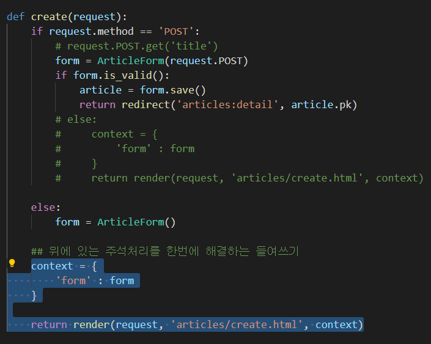

### 1. 왜 변수 context는 if else 구문과 동일한 레벨에 작성 되어있는가? 

```
context = {
        'form' : form
    }

    return render(request, 'articles/create.html', context)
    
    
이 부분을 두번 사용하는 것 보다 들여쓰기로 묶어준다.
```






### 2. 왜 request의 http method는 POST 먼저 확인하도록 작성하는가?

```
if request.method == 'POST' 를 통해 먼저 POST의 지정된 방식에 맞는지 확인한다. 
POST가 DB를 조작하기 때문!! GET은 DB를 조작하지 못한다.

우리가 작성한 max_length=10 과 같이 지정된 방식이 다음으로 실행되지 않기 때문이다.

그 후,

if form.is_valid() 를 통해 유효성 검사를 실시하고 저장한다.
```


