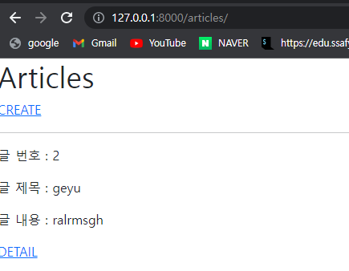
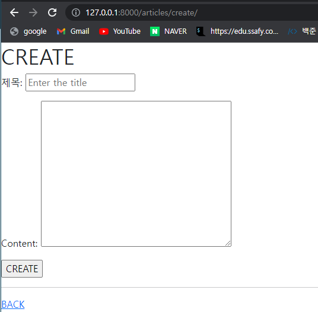
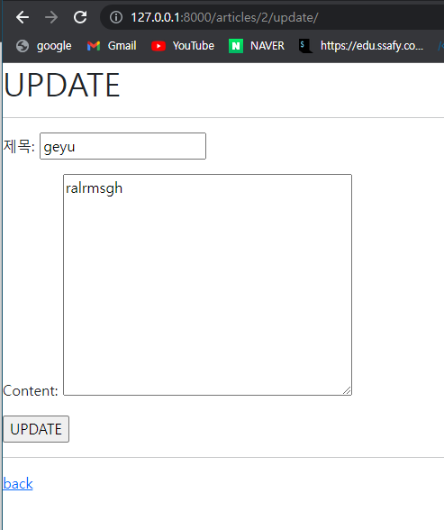

# url

```python
from django.urls import path, include
from . import views

app_name = 'articles'
urlpatterns = [
    # path('index/', views.index, name='index'),  ##이거 쓰려면 index이름 다르게
    path('', views.index, name='index'),
    path('create/', views.create, name='create'),
    path('<int:pk>/', views.detail, name='detail'),
    path('<int:pk>/delete/', views.delete, name='delete'),
    path('<int:pk>/update/', views.update, name='update'),
    #path('articles/', include('articles.urls'))
]

```

# view

```python
from multiprocessing import context
from django.shortcuts import redirect, render
from .forms import ArticleForm
from .models import Article
# Create your views here.

def index(request):
    articles = Article.objects.all()
    context = {
        'articles' : articles
    }
    return render(request, 'articles/index.html', context)

def create(request):
    if request.method == 'POST':
        # request.POST.get('title')
        form = ArticleForm(request.POST)
        if form.is_valid():
            article = form.save()
            return redirect('articles:detail', article.pk)         
        # else:
        #     context = {
        #         'form' : form
        #     }
        #     return render(request, 'articles/create.html', context)
            
    else:
        form = ArticleForm()

    ## 위에 있는 주석처리를 한번에 해결하는 들여쓰기
    context = {
        'form' : form
    }

    return render(request, 'articles/create.html', context)
    
    
def detail(request, pk):
    article = Article.objects.get(pk=pk)
    context = {
        'article' : article,
    }
    
    return render(request, 'articles/detail.html', context)


def delete(request, pk):
    article = Article.objects.get(pk=pk)
    if request.method == 'POST':
        article.delete()
        return redirect('articles:index')
    return redirect('articles:detail', article.pk)


def update(request, pk):
    article = Article.objects.get(pk=pk)
    if request.method == 'POST':
        # update
        form = ArticleForm(request.POST, instance=article)
        if form.is_valid():  # 유효성 검사
            article = form.save()
            return redirect('articles:detail', article.pk)
    else:
        # edit
        form = ArticleForm(instance=article)
    context = {
        'article': article,
        'form': form,
    }
    return render(request, 'articles/update.html', context)

```

# template

```



    <h1>CREATE</h1>
    <form action="" method = 'POST'> 
        
        {{form.as_p}}
        <input type="submit", value='CREATE'>
        <hr>
    </form>
    <a href="">BACK</a> 


```

```



    <h1>Detail</h1>

    <h1>{{ article.title }}</h1>
    <p>{{ article.content }}</p>
    <p>작성일: {{ article.created_at }}</p>
    <p>수정일: {{ article.updated_at }}</p>

    <a href="">UPDATE</a> 
    <form action="" method="POST">
        
        <input type="submit" value="DELETE">
    </form>


    <a href="">BACK</a> 


```

```



    <h1>Articles</h1>
    <a href="">CREATE</a>
    <hr>
    
        <p>글 번호 : {{ article.id }}</p>
        <p>글 제목 : {{ article.title }}</p>
        <p>글 내용 : {{ article.content }}</p>
        <a href="">DETAIL</a> 
        <hr>
        


```

```



  <h1>UPDATE</h1>
  <hr>
  <form action="" method="POST">
    
    {{ form.as_p }}
    <input type="submit", value = 'UPDATE'>
  </form>
  <hr>
  <a href="">back</a>
  
  

```


# model

```
from django.db import models

# Create your models here.

class Article(models.Model):
    title = models.CharField(max_length=10)
    content = models.TextField()
    created_at = models.DateTimeField(auto_now_add=True)
    updated_at = models.DateTimeField(auto_now=True)
```

