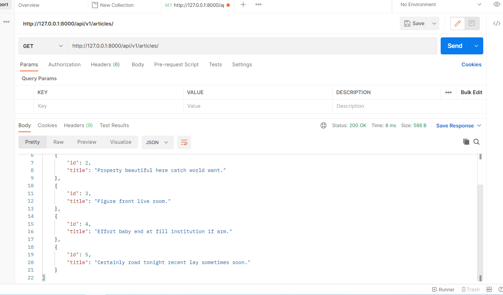
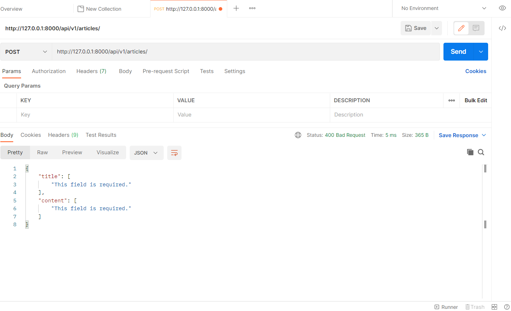
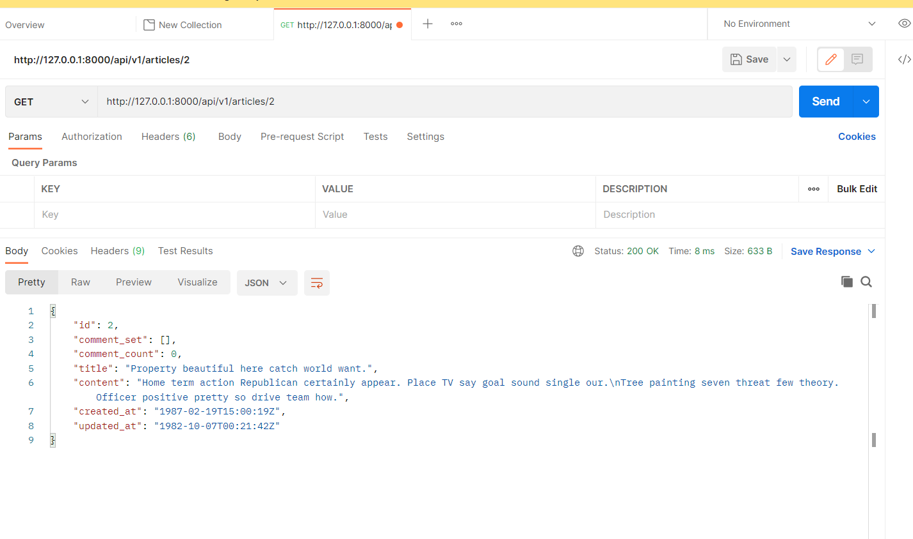
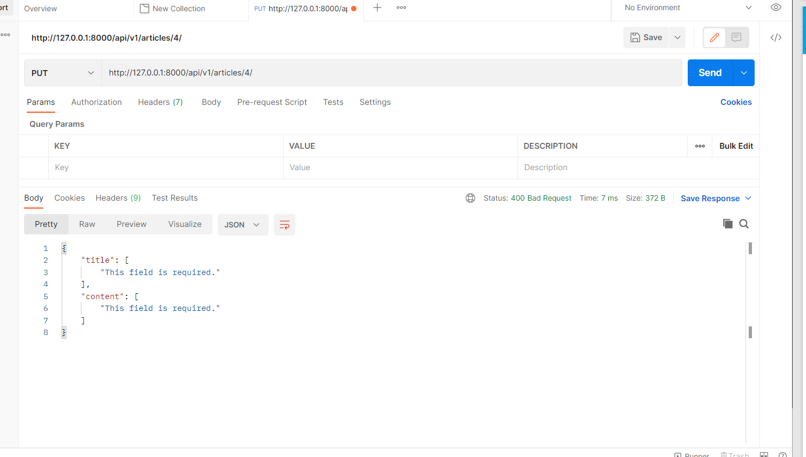
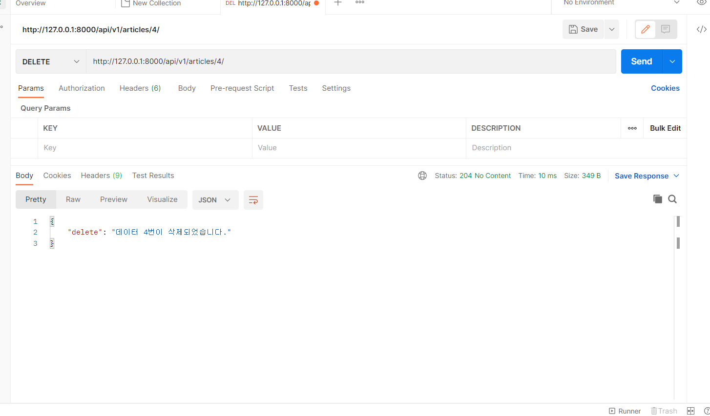

**views.py**

```python
from rest_framework import status
from rest_framework.response import Response
from rest_framework.decorators import api_view
from django.shortcuts import get_list_or_404, get_object_or_404
from .serializers import ArticleListSerializer, ArticleSerializer
from .models import Article
from articles import serializers

# Create your views here.
# @api_view()
@api_view(['GET', 'POST'])
def article_list(request):
    if request.method == 'GET':
        # articles = Article.objects.all()
        articles = get_list_or_404(Article)
        serializer = ArticleListSerializer(articles, many=True)
        return Response(serializer.data)

    elif request.method == 'POST':
        # print(request.data)
        serializer = ArticleSerializer(data=request.data)
        if serializer.is_valid(raise_exception=True):
            serializer.save()
            return Response(serializer.data, status=status.HTTP_201_CREATED)
        # return Response(serializer.errors, status=status.HTTP_400_BAD_REQUEST)


@api_view(['GET', 'DELETE', 'PUT'])
def article_detail(request, article_pk):
    article = get_object_or_404(Article, pk=article_pk)

    if request.method == 'GET':
        serializer = ArticleSerializer(article)
        return Response(serializer.data)

    elif request.method == 'DELETE':
        article.delete()
        data = {
            'delete': f'데이터 {article_pk}번이 삭제되었습니다.',
        }
        return Response(data, status=status.HTTP_204_NO_CONTENT)

    elif request.method == 'PUT':
        serializer = ArticleSerializer(article, request.data)
        # serializer = ArticleSerializer(article, data=request.data)
        if serializer.is_valid(raise_exception=True):
            serializer.save()
            return Response(serializer.data)

```


**serializers.py**

```python
from rest_framework import serializers
from .models import Article, Comment


class ArticleListSerializer(serializers.ModelSerializer):

    class Meta:
        model = Article
        fields = ('id', 'title',)
        
        
 

class ArticleSerializer(serializers.ModelSerializer):
   
    class Meta:
        model = Article
        fields = '__all__'
```









