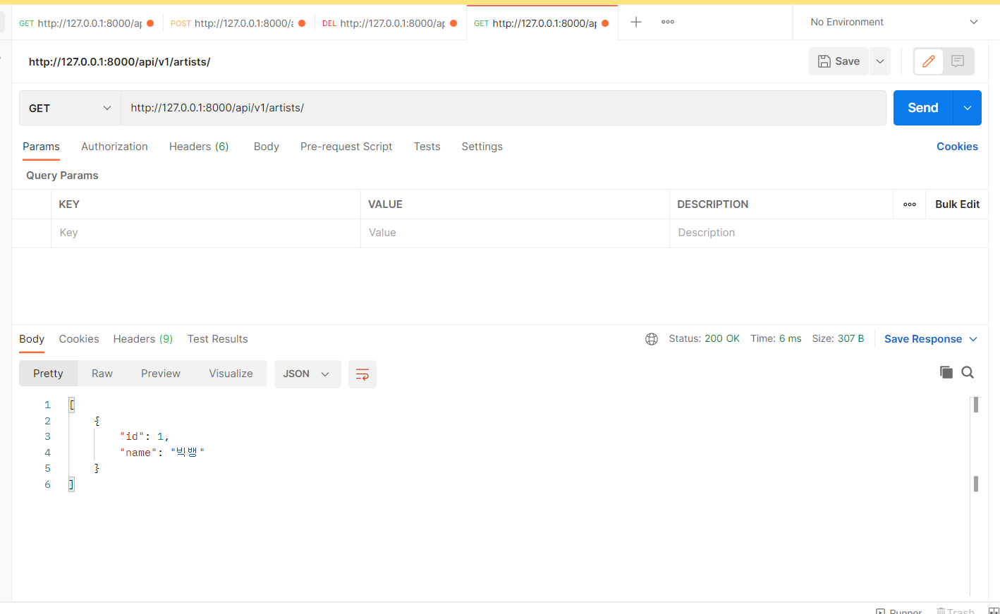
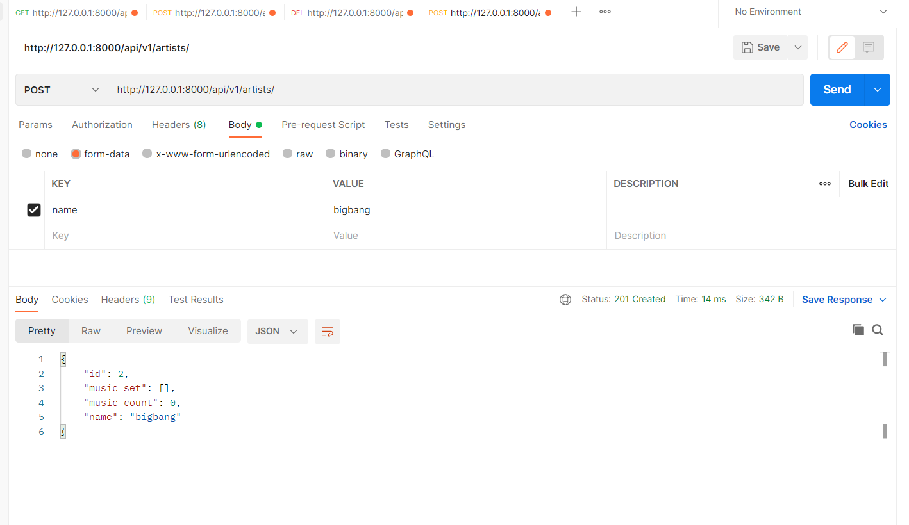
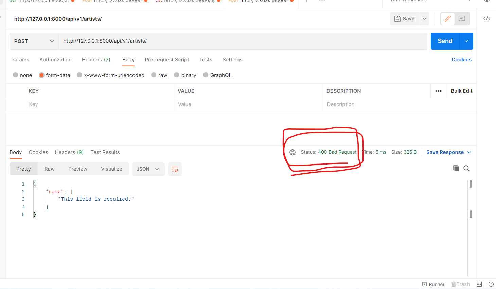
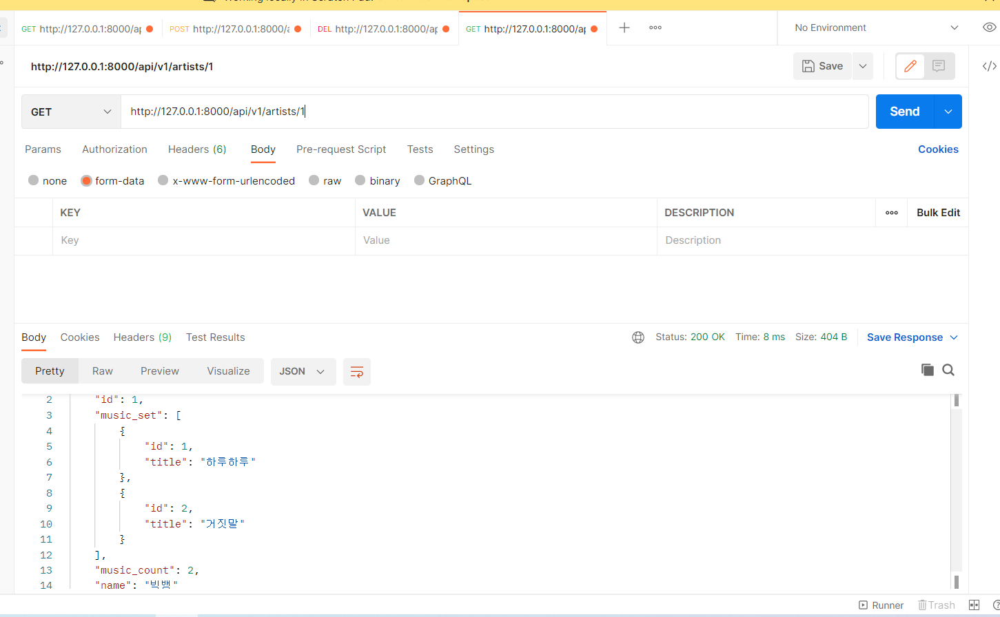
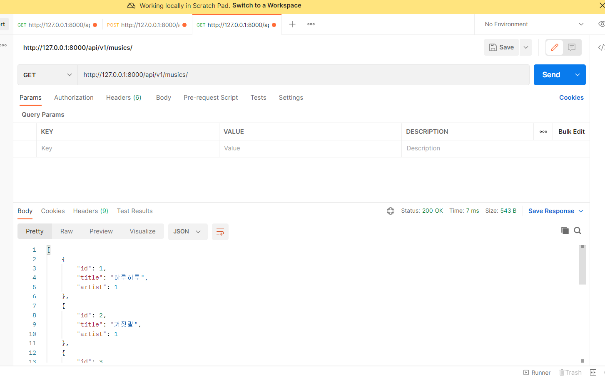
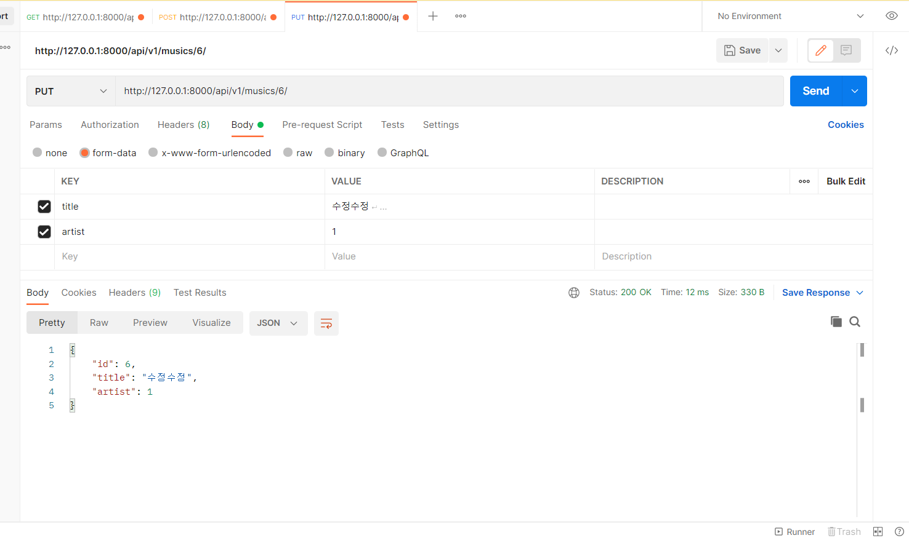
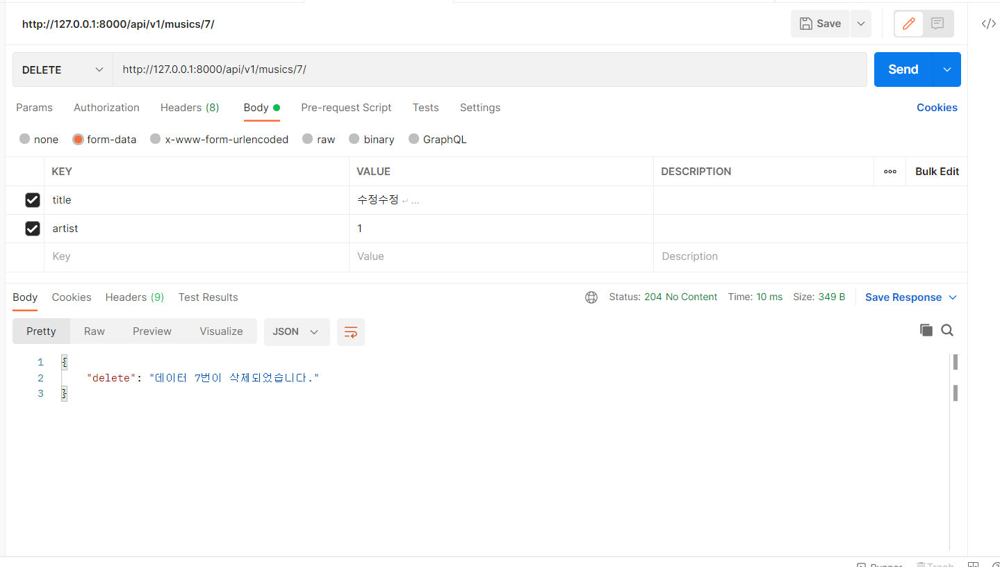

# views.py

```python
from rest_framework import status
from rest_framework.response import Response
from rest_framework.decorators import api_view
from django.shortcuts import get_list_or_404, get_object_or_404
from .serializers import ArticleListSerializer, ArticleSerializer, CommentSerializer
from .models import Article, Comment
from articles import serializers

# Create your views here.
# @api_view()
@api_view(['GET', 'POST'])
def article_list(request):
    if request.method == 'GET':
        # articles = Article.objects.all()
        articles = get_list_or_404(Article)
        serializer = ArticleListSerializer(articles, many=True)
        return Response(serializer.data)

    elif request.method == 'POST':
        # print(request.data)
        serializer = ArticleSerializer(data=request.data)
        if serializer.is_valid(raise_exception=True):
            serializer.save()
            return Response(serializer.data, status=status.HTTP_201_CREATED)
        # return Response(serializer.errors, status=status.HTTP_400_BAD_REQUEST)


@api_view(['GET', 'DELETE', 'PUT'])
def article_detail(request, article_pk):
    article = get_object_or_404(Article, pk=article_pk)

    if request.method == 'GET':
        serializer = ArticleSerializer(article)
        return Response(serializer.data)

    elif request.method == 'DELETE':
        article.delete()
        data = {
            'delete': f'데이터 {article_pk}번이 삭제되었습니다.',
        }
        return Response(data, status=status.HTTP_204_NO_CONTENT)

    elif request.method == 'PUT':
        serializer = ArticleSerializer(article, request.data)
        # serializer = ArticleSerializer(article, data=request.data)
        if serializer.is_valid(raise_exception=True):
            serializer.save()
            return Response(serializer.data)


@api_view(['GET'])
def comment_list(request):
    comments = get_list_or_404(Comment)
    serializer = CommentSerializer(comments, many=True)
    return Response(serializer.data)


@api_view(['GET', 'DELETE', 'PUT'])
def comment_detail(request, comment_pk):
    comment = get_object_or_404(Comment, pk=comment_pk)
    
    if request.method == 'GET':
        serializer = CommentSerializer(comment)
        return Response(serializer.data) 

    elif request.method == 'DELETE':
        comment.delete()
        data = {
            'delete': f'데이터 {comment_pk}번이 삭제되었습니다.',
        }
        return Response(data, status=status.HTTP_204_NO_CONTENT)

    elif request.method == 'PUT':
        serializer = CommentSerializer(comment, request.data)
        # serializer = CommentSerializer(comment, data=request.data)
        if serializer.is_valid(raise_exception=True):
            serializer.save()
            return Response(serializer.data)


@api_view(['POST'])
def comment_create(request, article_pk):
    article = get_object_or_404(Article, pk=article_pk)
    serializer = CommentSerializer(data=request.data)
    if serializer.is_valid(raise_exception=True):
        serializer.save(article=article)
        return Response(serializer.data, status=status.HTTP_201_CREATED)

```


# serializers.py

```python
from rest_framework import serializers
from .models import Article, Comment


class ArticleListSerializer(serializers.ModelSerializer):

    class Meta:
        model = Article
        fields = ('id', 'title', )


class CommentSerializer(serializers.ModelSerializer):

    class Meta:
        model = Comment
        fields = '__all__'
        read_only_fields = ('article',)


class ArticleSerializer(serializers.ModelSerializer):
    # comment_set = serializers.PrimaryKeyRelatedField(many=True, read_only=True)
    comment_set = CommentSerializer(many=True, read_only=True)
    comment_count = serializers.IntegerField(source='comment_set.count', read_only=True)

    class Meta:
        model = Article
        fields = '__all__'
```


