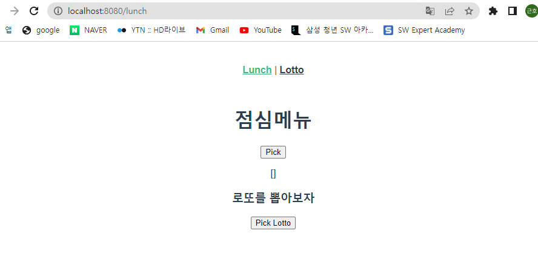
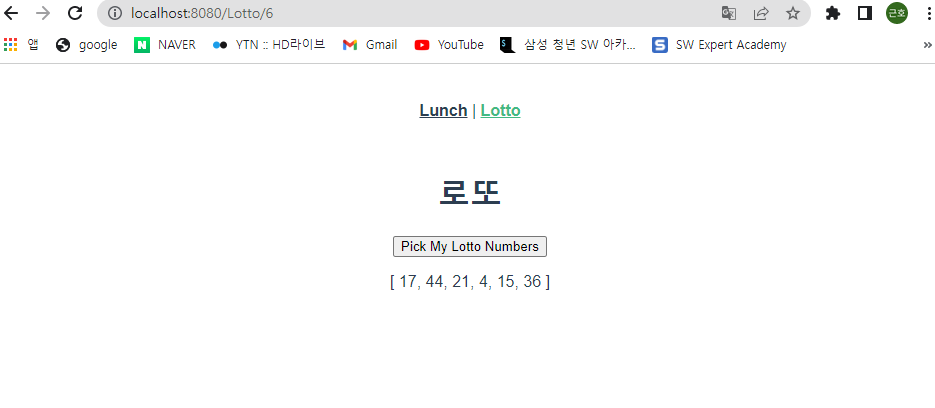

# LottoView.vue

```vue
<template>
  <div>
    <h1>로또</h1>
    <!-- <h2>{{ $route.params.lottoNum }}개의 번호를 추천합니다.</h2> -->
    <button @click="getLuckyNums">Pick My Lotto Numbers</button>
    <!-- <p>오늘의 추천 로또 번호</p> -->
    <p>{{ selectedLuckyNums }}</p>
  </div>
</template>

<script>
  import _ from 'lodash'

  export default {
    name: 'LottoView',
    data: function () {
      return {
        selectedLuckyNums: [],
      }
    },
    methods: {
      getLuckyNums: function () {
        const numbers = _.range(1, 46)
        this.selectedLuckyNums = _.sampleSize(
          numbers,
          this.$route.params.lottoNum,
        )
      }
    }
  }
</script>

<style>

</style>

```


# App.vue

```vue
<template>
  <div id="app">
    <nav>
      <!-- <router-link to="/">Home</router-link> | -->
      <router-link to="/lunch">Lunch</router-link> |
      <router-link :to="{ name: 'Lotto', params: { lottoNum: 6 } }">Lotto</router-link>
    </nav>
    <router-view/>
  </div>
</template>

<style>
#app {
  font-family: Avenir, Helvetica, Arial, sans-serif;
  -webkit-font-smoothing: antialiased;
  -moz-osx-font-smoothing: grayscale;
  text-align: center;
  color: #2c3e50;
}

nav {
  padding: 30px;
}

nav a {
  font-weight: bold;
  color: #2c3e50;
}

nav a.router-link-exact-active {
  color: #42b983;
}
</style>

```


# index.js

```js
import Vue from 'vue'
import VueRouter from 'vue-router'
import HomeView from '../views/HomeView.vue'
import LottoView from '../views/LottoView.vue'

Vue.use(VueRouter)

const routes = [
  {
    path: '/',
    name: 'home',
    component: HomeView
  },
  {
    path: '/lunch',
    name: 'lunch',
    // route level code-splitting
    // this generates a separate chunk (about.[hash].js) for this route
    // which is lazy-loaded when the route is visited.
    component: () => import(/* webpackChunkName: "about" */ '../views/AboutView.vue')
  },
  {
    path: '/Lotto/:lottoNum',
    name: 'Lotto',
    component: LottoView
  }
]

const router = new VueRouter({
  mode: 'history',
  base: process.env.BASE_URL,
  routes
})

export default router

```

