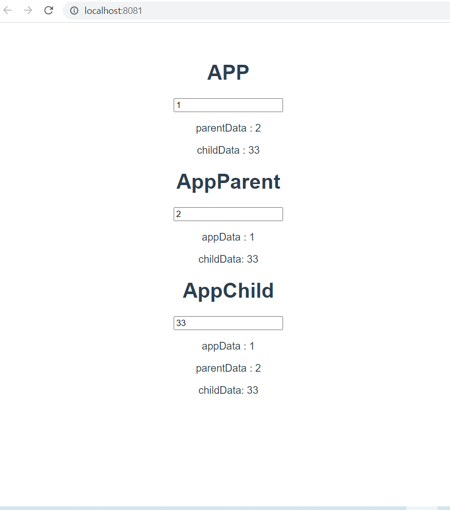

# App.vue

```vue
<template>
  <div id="app">
    <h1>APP</h1>
    <input type="text" @keyup.enter="onAppInput">
    <p>parentData : {{ parentInput }}</p>
    <p>childData : {{ childInput }}</p>
    <app-parent :appInput="AppInput" @input-parent="parentValChange" @input-child="childValChange"/>

  </div>
</template>

<script>
import AppParent from './components/AppParent.vue'

export default {
  name: 'App',
  components: {
    AppParent,
  },
  data: function () {
    return {
      AppInput : "",
      parentInput: "",
      childInput: "",
    }
  },
  methods: {
    onAppInput: function(event) {
      this.AppInput = event.target.value
    },
    parentValChange: function(value) {
      this.parentInput = value
    },
    childValChange: function(value) {
      this.childInput = value
    }
  }
}
</script>

<style>
#app {
  font-family: Avenir, Helvetica, Arial, sans-serif;
  -webkit-font-smoothing: antialiased;
  -moz-osx-font-smoothing: grayscale;
  text-align: center;
  color: #2c3e50;
  margin-top: 60px;
}
</style>

```

# AppChild.vue

```vue
<template>
  <div>
      <h1>AppChild</h1>
      <input type="text" @keyup.enter="onChildInput">
      <p>appData : {{ appInput }}</p>
      <p>parentData : {{ parentInput }}</p>
      <p>childData: {{ ChildInput }}</p>
  </div>
</template>

<script>
export default {
    name: 'AppChild',
    data: function () {
        return {
            ChildInput: ""
        }
    },
    methods: {
        onChildInput: function (event) {
            this.ChildInput = event.target.value
            this.$emit('child-input-change', this.ChildInput)
        }
    },
    props: {
        appInput: {
            type:String,
        },
        parentInput: {
            type:String,
        }
    }
}
</script>

<style>

</style>
```

# AppParent.vue

```vue
<template>
  <div>
    <h1>AppParent</h1>
    <input type="text" @keyup.enter="onParentInput">
    <p>appData : {{ appInput }}</p>
    <p>childData: {{childInput}}</p>
    <app-child :parentInput="parentInput" :appInput="appInput" @child-input-change="childValChange"/>
  </div>
</template>

<script>
import AppChild from "./AppChild.vue"

export default {
    name: 'AppParent',
    components:{
        AppChild,
    },
    data: function(){
        return{
            parentInput:"",
            childInput: "",
        }
    },
    methods:{
        childValChange: function(value) {
        this.childInput = value
        this.$emit("input-child", this.childInput)
        },
        onParentInput: function(event) {
            this.parentInput = event.target.value
            this.$emit('input-parent', this.parentInput)
        }
    },
    props: {
        appInput: {
            type: String,
        }
    }
}
</script>

<style>

</style>
```


------


# App.vue

```vue
<template>
  <div id="app">
    <the-search-bar @input-change="onInputChange"/>
    <video-detail :video="selectedVideo"/>
    <video-list
      :videos="videos"
      @select-video="onSelectVideo"
    />

  </div>
</template>

<script>
import axios from 'axios'
import TheSearchBar from './components/TheSearchBar.vue'
import VideoList from './components/VideoList.vue'
import VideoDetail from './components/VideoDetail.vue'

export default {
  name: 'App',
  components: {
    TheSearchBar,
    VideoList,
    VideoDetail,
  },
  data: function () {
    return {
      videos: [],
      selectedVideo: null
    }
  },
  methods: {
    onInputChange: function (value) {
      // console.log(value)
      const API_KEY = process.env.VUE_APP_YOUTUBE_API_KEY
      axios.get('https://www.googleapis.com/youtube/v3/search', {params: {
          key: API_KEY,
          part: 'snippet',
          type: 'video',
          q: value
        }}, {})
      //   methods: 'get',
      //   url: 'https://www.googleapis.com/youtube/v3/search',
      //   params: {
      //     key: API_KEY,
      //     part: 'snippet',
      //     type: 'video',
      //     q: value
      //   }
      // })
        .then((res)=>{
          // console.log(res.data)
          this.videos = res.data.items
        })
    },
    onSelectVideo: function (video) {
      console.log('APP', video)
      this.selectedVideo = video
    }
  }
}
</script>

<style>
#app {
  font-family: Avenir, Helvetica, Arial, sans-serif;
  -webkit-font-smoothing: antialiased;
  -moz-osx-font-smoothing: grayscale;
  text-align: center;
  color: #2c3e50;
  margin-top: 60px;
}
</style>

```

# TheSearchBar.vue

```vue
<template>
<div>
  <h1>검색하고 싶은 항목을 입력하세요</h1>
  <input type="text" @keyup.enter='onInputValue'>
</div>
</template>

<script>
export default {
  name: 'TheSearchBar',
  methods: {
    onInputValue: function (event) {
      // console.log(event)
      this.$emit('input-change', event.target.value)
    }
  }
}
</script>

<style>

</style>
```

# VideoDetail.vue

```vue
<template>
  <div>
    <!-- {{ video }} -->
    <div v-if="video">
      <h1>Video Detail</h1>
      <iframe :src="videoURL" frameborder="0"></iframe>
    </div>
  </div>
  
</template>

<script>
export default {
  name: 'VideoDetail',
  props: {
    video: {
      type: Object,
    }
  },
  computed: {
    videoURL: function () {
      return `https://www.youtube.com/embed/${this.video.id.videoId}`
    }
  }
}
</script>

<style>

</style>
```

# VideoList.vue

```vue
<template>
  <div>
      <h1>Video List</h1>
      <ul>
          <!-- <li v-for='video in videos' :key='video.id.videoId'>
              {{ video.snippet.title }}
          </li> -->
        <video-list-item
          v-for="video in videos" :key="video.id.videoId"
          :video="video"
          @select-video = "onSelectVideo"
        />
      </ul>
      <!-- {{ videos }} -->
  </div>
</template>

<script>
import VideoListItem from './VideoListItem.vue'

export default {
  name: 'VideoList',
  components: {
      VideoListItem
  },
  props: {
    videos: {
        type: Array,
        required: true
    }
  },
  methods : {
    onSelectVideo: function (video) {
      console.log('VideoList', video)
      this.$emit('select-video', video)
    }
  }
}
</script>

<style>

</style>
```

# VideoListItem.vue

```vue
<template>
  <div>
    <!-- <h1>Video List Item</h1>
    {{ video }} -->
    <li @click="selectVideo">
      
      {{ video.snippet.title }}
    </li>
  </div>
</template>

<script>
export default {
  name: 'VideoListItem',
  props: {
    video: {
      type: Object,
      required: true
    }
  },
  methods: {
    selectVideo: function () {
      // console.log(event)
      this.$emit('select-video', this.video)
    }
  }
}
</script>

<style>

</style>
```

