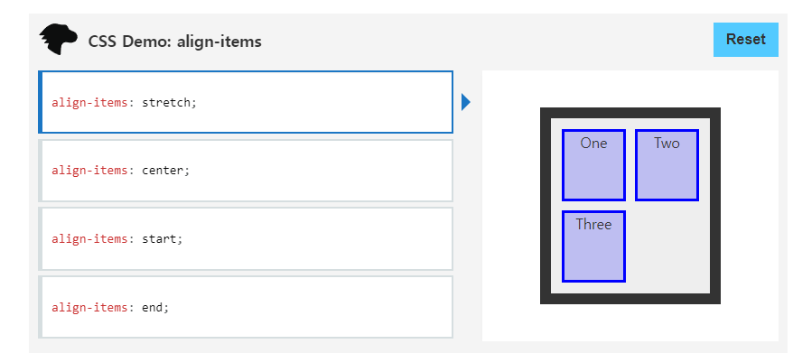
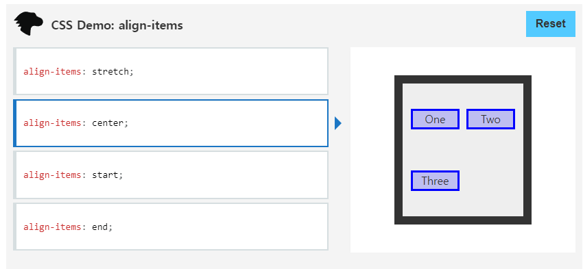
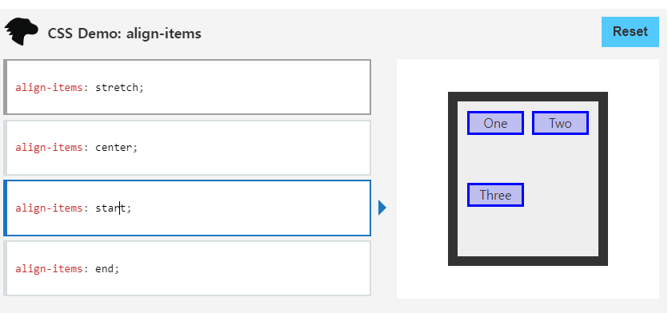
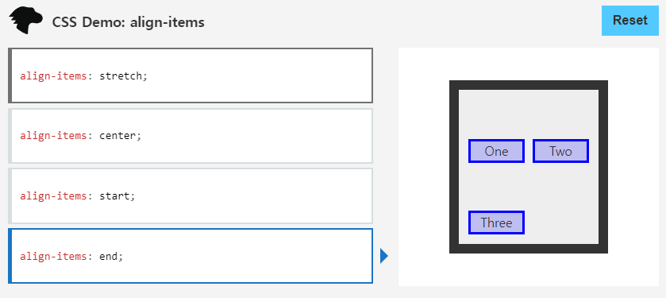

# 1. CSS flex-direction
flex-direction: row;
한 줄의 글을 작성하는 방향대로

flex-direction: row-reverse;
<row>처럼, 대신 역방향

flex-direction: column;
글 여러 줄이 쌓이는 방향대로

flex-direction: column-reverse;
<column>처럼, 대신 역방향

# 2.
1) row
div class="d-flex flex-row"

2) row-reverse
div class="d-flex flex-row-reverse"

3) column
div class="d-flex flex-column"

4) column-reverse
div class="d-flex flex-column-reverse"

# 3.
align-items: stretch;
Flex 항목은 너비 및 높이 제약 조건을 준수하면서 항목 여백 상자의 교차 크기가 선과 동일하도록 늘어납니다.
align-items: center;
플렉스 항목의 여백 상자는 교차 축의 선 중앙에 있습니다. 항목의 교차 크기가 플렉스 컨테이너보다 크면 양방향으로 동일하게 오버플로됩니다.
align-items: start;
항목은 해당 축에서 정렬 컨테이너의 시작 가장자리를 향해 서로 같은 높이로 포장됩니다.
align-items: end;
항목은 해당 축에서 정렬 컨테이너의 끝 가장자리를 향해 서로 같은 높이로 포장됩니다.

# 4.
flex-flow 는 
 - flex-direction과 flex-wrap 의 shorthand
 - flex-direction과 flex-wrap에 대한 설정 값을 차례대로 작성해야합니다.
 - 예시) flex-flow: row nowrap;

 (1) flex-direction flex-wrap

# 5.
a = container
b = row

# 6.
c = 
Extra small (xs) <576px
Small (sm) ≥576px
Medium (md) ≥768px
Large (lg) ≥992px
Extra large (xl) ≥1200px
Extra extra large (xxl) ≥1400px

d = 
대부분 12이하의 숫자
만약, 단일 행에 12개 이상의 열이 있는 경우 추가 열의 각 그룹은 하나의 단위로 새 줄로 줄바꿈됩니다.